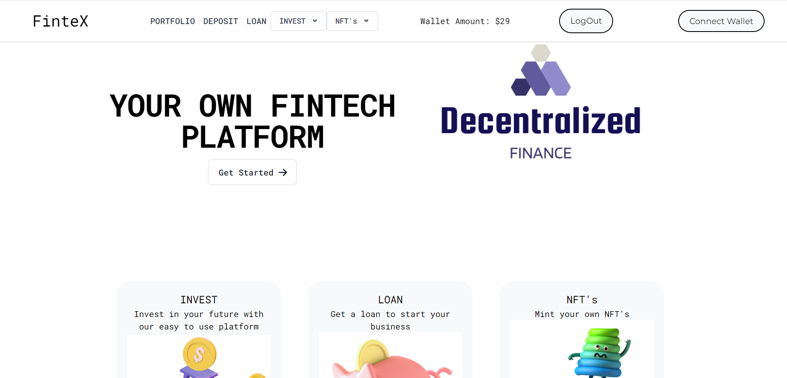
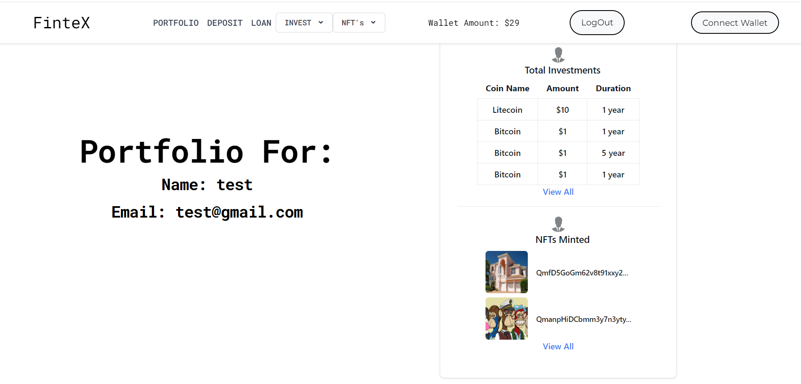
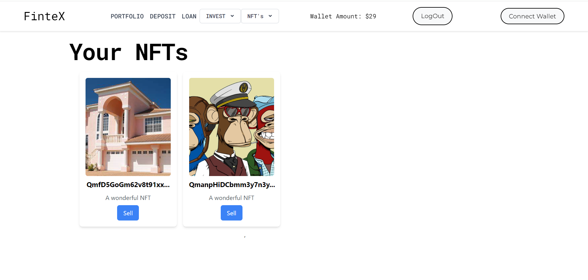

# DeFi Lending Platform

## Abstract
This project is a comprehensive Decentralized Finance (DeFi) Lending Platform that provides users with a wide array of financial services in a secure and user-friendly manner. Users can sign up, deposit funds using Razorpay, take loans, repay loans, invest in various cryptocurrencies, mint NFTs by watching videos, and buy/sell NFTs on the platform. All transactions are securely managed using the Ethereum blockchain and smart contracts written in Solidity, ensuring transparency and security.

## Screenshots

  
  

## Video Demo
Here is the demo video link you can watch the project flow here...
[![Watch the video]](https://www.youtube.com/watch?v=Xs85d6qPif8)

## Test the App
You can test the app using the following credentials:
- **Username:** test
- **Email:** test@gmail.com
- **Password:** 123

## Detailed Description

### Purpose
The primary purpose of this project is to provide a secure and user-friendly Decentralized Finance (DeFi) Lending Platform. The platform aims to combine traditional financial services with innovative blockchain technology to offer users a comprehensive suite of financial activities, including depositing funds, taking loans, investing in cryptocurrencies, and engaging in the NFT marketplace.

### Functionality
- **User Authentication:** Secure sign-up and sign-in process.
- **Deposit Funds:** Users can deposit money into their wallet using Razorpay.
- **Loan Management:** Users can take loans and repay them seamlessly.
- **Investments:** Users can invest in a variety of cryptocurrencies with ease.
- **NFT Minting:** Users can mint NFTs by watching shows, videos, or movies of their favorite genres.
- **NFT Trading:** Users can buy and sell NFTs on the platform, with the restriction that they cannot buy their own NFTs.
- **Portfolio Management:** Users can view their portfolio, including investments, loans, and NFTs.

### Features
- **Secure Transactions:** All transactions are secured by the Ethereum blockchain and smart contracts.
- **User-Friendly Interface:** The platform is built with a responsive and intuitive interface using React and Bootstrap.
- **Seamless Payment Integration:** Razorpay is integrated for smooth deposit and loan repayment processes.
- **Diverse Investment Options:** Users have multiple cryptocurrency options for investment.
- **Innovative NFT System:** Unique feature allowing users to mint NFTs by consuming media content.

## Technologies Used

### Programming Languages
- **Solidity:** For writing smart contracts on the Ethereum blockchain.

### Frameworks and Libraries
- **React:** For building the frontend user interface.
- **Web3.js:** For interacting with the Ethereum blockchain and smart contracts.
- **OpenZeppelin:** For secure smart contract templates.
- **Razorpay API:** For handling secure payment processing.

### Backend
- **Node.js:** For server-side logic.
- **Express.js:** For creating the RESTful API.
- **MongoDB:** For storing user information and investment data.

### Tools
- **Hardhat:** For compiling, deploying, testing, and debugging Solidity smart contracts.
- **Pinata:** For managing files on IPFS.
- **MetaMask:** For cryptocurrency wallet and blockchain interaction.

### Security
- **Ethereum Blockchain:** Ensures decentralized and secure transaction processing.
- **Smart Contracts:** Provides transparency and security for all platform operations.

### User Interface and Experience
- **Bootstrap:** For a responsive and visually appealing UI.
- **Toastify:** For user feedback and notifications.

### Development and Deployment
- **Git:** For version control.
- **GitHub:** For hosting the project repository.

